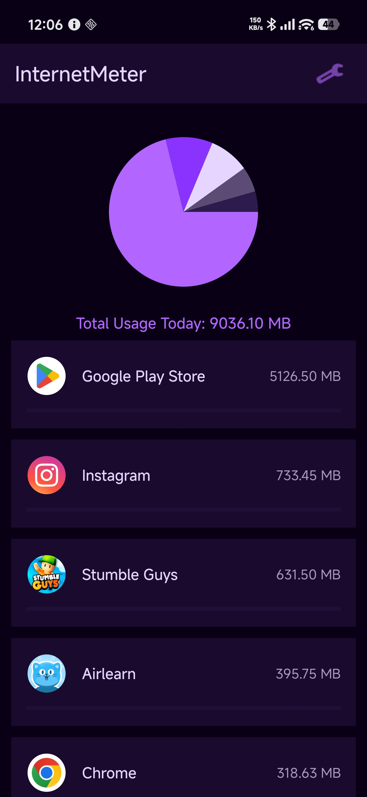
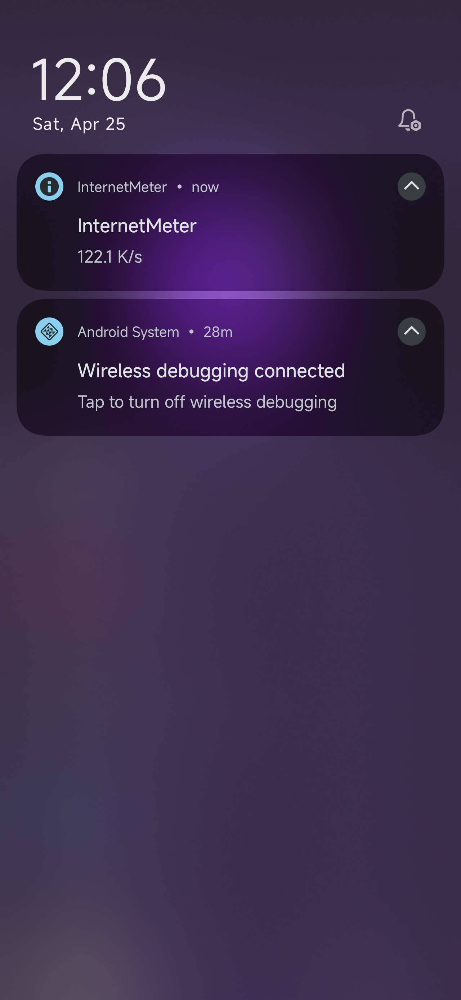
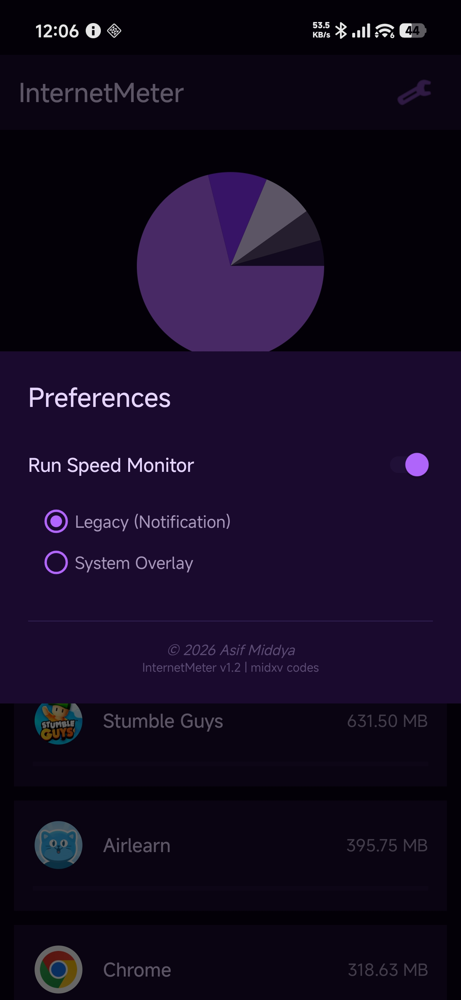

# InternetMeter 🚀

A sleek, privacy-focused Android application that monitors your real-time internet speed and tracks app-wise data usage with a beautiful deep dark purple UI.

## Features ✨
* **Real-time Speed Monitor**: Choose between a discreet system notification mode or a floating status bar overlay.
* **Smart Notch Detection**: Automatically detects device display cutouts and positions the overlay perfectly.
* **Data Usage Tracking**: Deep integration with Android's `NetworkStatsManager` to pull accurate daily data consumption metrics.
* **Visual Insights**: Interactive custom Pie Chart breaking down data usage by application.
* **Privacy First**: All data is processed completely locally on your device. Zero external servers.

## Screenshots 📸

  
  
  

## Tech Stack 🛠️
* **Language**: Kotlin
* **UI Framework**: Native XML Layouts
* **Key APIs**: Android Foreground Services, System Overlay (`SYSTEM_ALERT_WINDOW`), DisplayCutout API, NetworkStatsManager

## License 📄
This project is licensed under the MIT License - see the [LICENSE.md](LICENSE.md) file for details.